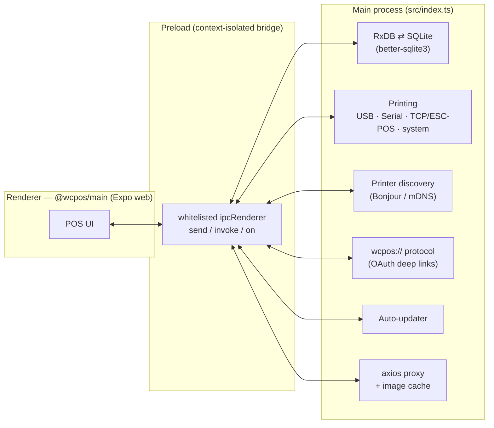

<div align="center">
  
  <h1>WCPOS Desktop</h1>
  <p>The <a href="https://wcpos.com">WooCommerce POS</a> desktop client for Windows, macOS and Linux.</p>
  <p>
    <a href="https://github.com/wcpos/electron/actions/workflows/tag-and-release.yml">
      
    </a>
    <a href="https://github.com/wcpos/electron/actions/workflows/test.yml">
      
    </a>
    <a href="https://github.com/wcpos/electron/releases/latest">
      
    </a>
    <a href="./package.json">
      
    </a>
    <a href="https://wcpos.com/discord">
      
    </a>
  </p>
  <p>
    <a href="#-about"><b>About</b></a>
    &ensp;&mdash;&ensp;
    <a href="#-how-it-works"><b>How it works</b></a>
    &ensp;&mdash;&ensp;
    <a href="#-development"><b>Development</b></a>
    &ensp;&mdash;&ensp;
    <a href="#-building--packaging"><b>Building</b></a>
    &ensp;&mdash;&ensp;
    <a href="https://github.com/wcpos/electron/releases/latest"><b>Download</b></a>
  </p>
</div>

## 💡 About

**WCPOS Desktop** is the [Electron](https://www.electronjs.org/) shell that packages the cross-platform [WooCommerce POS](https://wcpos.com) client as a native desktop app. It wraps the shared React Native / Expo web app (`@wcpos/main`) and adds the native capabilities a point-of-sale terminal needs but a browser cannot provide:

- **Receipt printing** to USB, serial and network (ESC/POS) printers, plus the system print dialog.
- **Printer discovery** on the local network via Bonjour/mDNS.
- **Local-first data** backed by SQLite through an RxDB storage bridge.
- **OAuth deep-linking** via a custom `wcpos://` protocol handler.
- **Auto-updates** delivered straight from GitHub releases.

WCPOS requires [WooCommerce](https://woocommerce.com) and the [WooCommerce POS plugin for WordPress](https://github.com/wcpos/woocommerce-pos) as its backend. This repository builds and ships the desktop installers — see the [latest release](https://github.com/wcpos/electron/releases/latest) to download.

> This repo is also a submodule of the [WCPOS monorepo](https://github.com/wcpos/monorepo) at `apps/electron`. The UI it renders lives in the monorepo's `@wcpos/main` package, so building from source requires a monorepo checkout (see [Development](#-development)).

## 🛠 How it works

The app is split across Electron's three process types. The **renderer** is the WCPOS Expo web build — in development it points at the local Expo dev server, and in production it serves the static `expo export` bundle from disk via [`electron-serve`](https://github.com/sindresorhus/electron-serve) under the `wcpos://` scheme. The **main** process owns all native integrations and talks to the renderer over a tightly whitelisted **preload** bridge.



Communication is locked down for security: `contextIsolation` is on, `nodeIntegration` is off, and [`src/preload.ts`](./src/preload.ts) only forwards an explicit allow-list of IPC channels (e.g. `sqlite`, `rxStorage`, `axios`, `print-raw-tcp`, `printer-discovery`, `auth:prompt`).

### Key native services

| Area | Files | Notes |
| --- | --- | --- |
| App bootstrap | [`src/index.ts`](./src/index.ts) | Window lifecycle, power-monitor events, startup sequence |
| Storage | [`src/main/rxdb-storage.ts`](./src/main/rxdb-storage.ts), [`src/main/database.ts`](./src/main/database.ts) | RxDB v17 over `better-sqlite3`, with an IPC attachment bridge |
| Printing | [`src/main/print-raw-tcp.ts`](./src/main/print-raw-tcp.ts), [`src/main/usb-printer.ts`](./src/main/usb-printer.ts), [`src/main/serial-printer.ts`](./src/main/serial-printer.ts), [`src/main/winspool-printer.ts`](./src/main/winspool-printer.ts), [`src/main/print-external-url.ts`](./src/main/print-external-url.ts) | Raw ESC/POS over TCP, USB and serial; Windows USB routes through the print spooler |
| Discovery | [`src/main/printer-discovery.ts`](./src/main/printer-discovery.ts), [`src/main/bluetooth-select.ts`](./src/main/bluetooth-select.ts) | mDNS network printer discovery and Bluetooth device selection |
| Networking | [`src/main/axios.ts`](./src/main/axios.ts), [`src/main/image-cache.ts`](./src/main/image-cache.ts) | Main-process HTTP proxy and image caching |
| Auth | [`src/main/auth-handler.ts`](./src/main/auth-handler.ts), [`src/main/protocol.ts`](./src/main/protocol.ts) | `wcpos://` deep-link handling for OAuth flows |
| Updates | [`src/main/update.ts`](./src/main/update.ts) | Checks `https://updates.wcpos.com` and applies GitHub release assets |
| Shell | [`src/main/window.ts`](./src/main/window.ts), [`src/main/menu/`](./src/main/menu) | Browser window and native application menus |

## 📁 Project structure

```
src/
  index.ts            # Main-process entry point
  preload.ts          # Context-isolated IPC bridge (renderer <-> main)
  renderer.ts         # Renderer entry (loads the Expo web bundle)
  main/               # Main-process services (storage, printing, auth, update, …)
    menu/             # Native application menu definitions
    translations/     # Bundled i18n strings for native chrome (menus, dialogs)
forge.config.ts       # Electron Forge: packaging, makers, publishers, signing
webpack.*.config.ts   # Webpack config for the main & renderer bundles
icons/                # App icons per platform (.ico / .icns / .png / .svg)
flathub/              # Flathub manifest & metadata for the Linux Flatpak
```

## 👩‍💻 Development

The renderer (`@wcpos/main`) lives in the [WCPOS monorepo](https://github.com/wcpos/monorepo), so develop this app from inside a monorepo checkout where this repo is the `apps/electron` submodule.

**Prerequisites**

- [Node.js](https://nodejs.org) 22+
- [pnpm](https://pnpm.io) (the version is pinned via `packageManager` in `package.json`)
- Platform build tools for native modules (`better-sqlite3`, `usb`, `serialport`) — Xcode CLT on macOS, build-essential/libudev on Linux, the relevant MSVC toolchain on Windows
- An [RxDB Premium](https://rxdb.info/premium.html) license token (the app depends on `rxdb-premium`). CI injects it into `package.json` under `accessTokens["rxdb-premium"]`; do the same locally for installs to succeed.

**Run the app**

```bash
# from the monorepo root, with this repo checked out at apps/electron
cd apps/electron
pnpm install

# rebuild native modules against the bundled Electron ABI
pnpm rebuild:all

# start the Expo dev server + Electron together
pnpm dev
```

`pnpm dev` runs two processes concurrently:

- `dev:expo` — serves `@wcpos/main` as a web app on port `8088` (override with `EXPO_PORT`).
- `dev:electron` — launches Electron via `electron-forge start`, which loads `http://localhost:8088`.

**Useful scripts**

| Script | Description |
| --- | --- |
| `pnpm dev` | Run the Expo dev server and Electron together |
| `pnpm lint` / `pnpm lint:fix` | Lint the `src/` tree |
| `pnpm ts:check` | Type-check with `tsc --noEmit` |
| `pnpm test` | Run the main/preload test suite (see below) |
| `pnpm rebuild:all` | Rebuild `better-sqlite3` and `usb` for Electron |
| `pnpm package` | Package the app without producing installers |
| `pnpm make` | Build platform installers |
| `pnpm publish-app` | Build and publish a release to GitHub |

## 🧪 Testing

Tests are lightweight `ts-node` scripts that exercise the main-process and preload logic without a full Electron runtime. `pnpm test` runs them all:

- `test:preload` — IPC channel allow-listing
- `test:rxdb-ipc-attachments` — RxDB attachment serialization over IPC
- `test:image-cache` — image cache behaviour
- `test:printer-discovery` / `test:bluetooth-select` — discovery and device selection
- `test:winspool-printer` / `test:serial-printer` — Windows spooler and serial printing
- `test:package-runtime-externals` — verifies runtime-external native deps are bundled

CI ([`.github/workflows/test.yml`](./.github/workflows/test.yml)) runs `pnpm lint`, `tsc`, and `pnpm test` on every push and PR to `main`.

## 📦 Building & packaging

Packaging is driven by [Electron Forge](https://www.electronforge.io/) ([`forge.config.ts`](./forge.config.ts)). Because the UI is built separately, a production build is a two-step process:

1. **Build the renderer** (from the monorepo) and place the export in this repo's `dist/`:
   ```bash
   pnpm --filter @wcpos/main build:electron   # -> apps/main/electron-build
   # copy/move that output to apps/electron/dist
   ```
   Forge bundles `dist/` into the app via `extraResource`, and `electron-serve` serves it under `wcpos://`.
2. **Make the installers:**
   ```bash
   pnpm make
   ```

**Targets**

| Platform | Maker | Output |
| --- | --- | --- |
| Windows | Squirrel | `.exe` installer |
| macOS | DMG + ZIP | signed & notarized `.dmg` / `.zip` |
| Linux | Deb / Rpm | `.deb`, `.rpm` |
| Linux | Flatpak | Flatpak bundle / [Flathub](./flathub) (opt-in via `WCPOS_FLATPAK=1`) |

## 🚀 Releases & auto-update

Pushes to `main` trigger the [Publish workflow](./.github/workflows/tag-and-release.yml): it builds the Expo renderer, then builds, signs and publishes platform installers to [GitHub Releases](https://github.com/wcpos/electron/releases). Installed apps check for updates against `https://updates.wcpos.com` and apply new release assets in place. Changes are tracked in [`CHANGELOG.md`](./CHANGELOG.md).

## 🤝 Contributing

Issues and pull requests are welcome. Please run `pnpm lint`, `pnpm ts:check` and `pnpm test` before opening a PR. Project-specific agent and review guidelines live in [`AGENTS.md`](./AGENTS.md).

## 🔗 Links

- 🌐 Website — [wcpos.com](https://wcpos.com)
- 📦 Monorepo — [github.com/wcpos/monorepo](https://github.com/wcpos/monorepo)
- 🔌 WordPress plugin — [github.com/wcpos/woocommerce-pos](https://github.com/wcpos/woocommerce-pos)
- 💬 Discord — [wcpos.com/discord](https://wcpos.com/discord)

## 📄 License

[MIT](./package.json) © Paul Kilmurray
